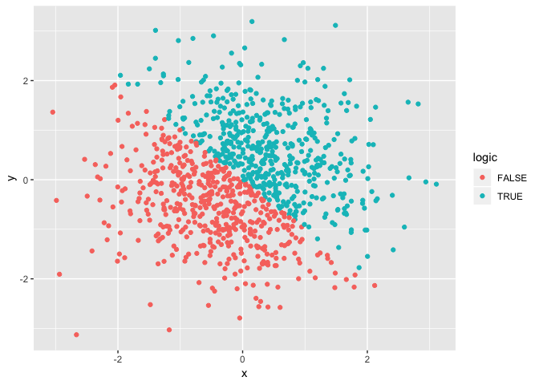
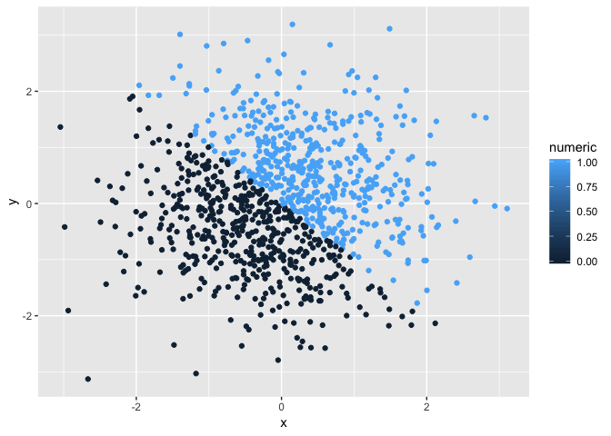
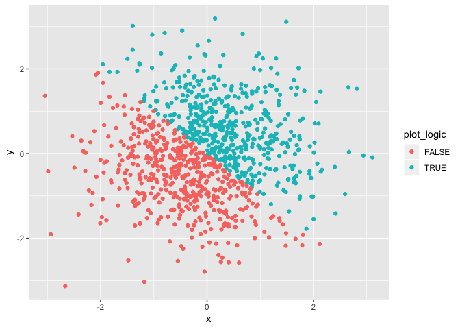

R markdown
================
Zanis Fang
9/17/2018

Problem 1
---------

``` r
#set seed to make it reproducible
set.seed(1)

#create the data frame
df_diff_types <- data.frame(
    
    #assign values
  vector_numeric   <- runif(10, 0, 5),
  vector_logic     <- vector_numeric > 2,
  vector_character <- character(length = 10),
  vector_factor    <- factor(x = character(length = 10), levels = 10)
  
)

#rename the columns
colnames(df_diff_types) <- c("numeric", "logic", "character", "factor")
```

Despite this default "mean" function can take all of these four kinds of objects as its "x" argument, taking means only works for numeric and logic vectors, but for character and factor vectors it only returns NA.

``` r
#apply as.numeric function to logic, character, and factor variables
lapply(df_diff_types[2:4], FUN = as.numeric)
```

Coercing the three vectors into numeric data type.

``` r
#convert charactor vector to factor then to numeric vectors
char_to_fact <- as.factor(vector_character)
char_to_num  <- as.numeric(char_to_fact)

#convert factor vector to character then to numeric vectors
fact_to_char <- as.character(vector_factor)
fact_to_num  <- as.numeric(fact_to_char)
```

Problem 2
---------

``` r
#set seed for reproducibility
set.seed(12)

#create datafram for plotting
df_plot <- data.frame(
    
    #assign x, y
    x <- rnorm(1000),
    y <- rnorm(1000),
    
    #coloring
    plot_logi <- x + y > 0,
    plot_num  <- as.numeric(plot_logi),
    plot_fact <- as.factor(plot_logi)
    
)

#rename the columns of the dataframe
colnames(df_plot) <- c("x", "y", "logic", "numeric", "factor")
```

The size of the dataframe is 1000, 5, the mean and median of x is -0.0264365 and -0.0412079, the proportion of TRUEs in the logic vector is 0.503.

``` r
#create ggplot2 data type
scatter_plot <- ggplot(df_plot, aes(x = x, y = y))

#scatter plots using different coloring strategies
scatter_plot + geom_point(aes(color = logic))
```



``` r
scatter_plot + geom_point(aes(color = numeric))
```



``` r
scatter_plot + geom_point(aes(color = factor))
```



For scatterplot coloring points using logic or factor variables, the color scales are discrete because these two types of variable assuming the values in the vectors are exhaustive. But for numeric variable it assuming the values can be any real number, so the color scale is continuous.
